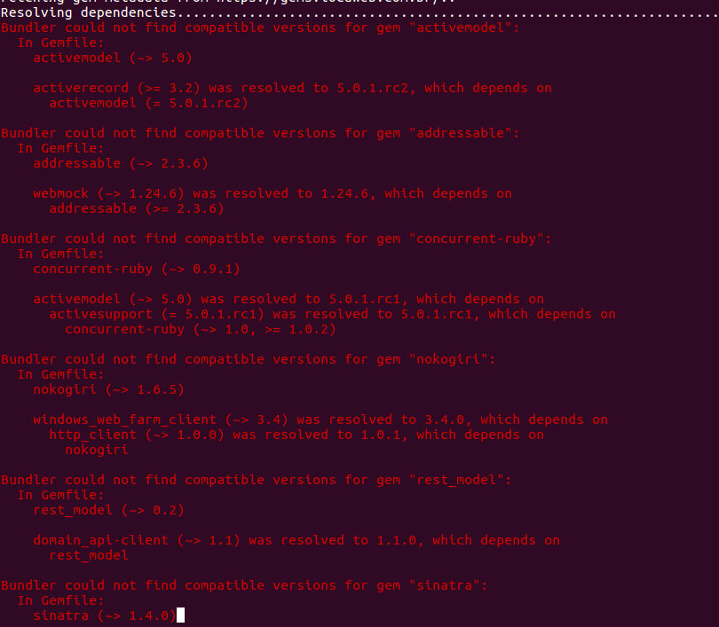

!SLIDE center subsection

# Good practices to help when upgrading the Ruby version in an application

## Fabio Perrella

### Tech Leader @ Locaweb

!SLIDE center red

# **Warning:** this talk does not have all the answers you may looking for

## Upgrading Ruby can be very difficult sometimes!

!SLIDE center

# Why upgrade Ruby version? (in an application)

!SLIDE center

# Why upgrade Ruby?

* Every christmas a new (minor) version of Ruby is released
* Every march (or february) the last supported minor version reaches the end-of-life (eol)

!SLIDE center

# Last Ruby releases

    Ruby 2.7
    status: preview
    release date:

    Ruby 2.6
    status: normal maintenance
    release date: 2018-12-25

    Ruby 2.5
    status: normal maintenance
    release date: 2017-12-25

    Ruby 2.4
    status: security maintenance
    release date: 2016-12-25
    EOL date: 2020-03-31

!SLIDE center

# What about Rails??

- Rails has a release frequency slower than Ruby

- I will not talk about upgrading Rails in this talk (maybe next year!)

- Upgrading Ruby is a prerequisite to upgrade Rails (normally)

!SLIDE center

## Imagine a perfect world when you upgrade the Ruby version and all the tests pass in the 1st attempt...

!SLIDE center red big

# Now, wake up!!

!SLIDE center

# 1st problem: **bundle install**

!SLIDE center

# 1st problem: **bundle install**

* Some gems only work on a specific range of Ruby versions
* Some gems have dependencies which works only on a specific range of Ruby versions
* Some gems **do not** know they only work on a specific range of Ruby versions or dependencies!

!SLIDE center

# How a gem specifies the required Ruby version

    @@@ruby
    # This gem will work with 1.8.6 or greater...
    spec.required_ruby_version = '>= 1.8.6'

    # Only with ruby 2.0.x
    spec.required_ruby_version = '~> 2.0'

    # Only prereleases or final releases after 2.6.0.preview2
    spec.required_ruby_version = '> 2.6.0.preview2'

https://guides.rubygems.org/specification-reference/#required_ruby_version

!SLIDE center

## Try to upgrade to the latest Ruby version

Gems are not used to restrict the new versions, examples:

    @@@text
    sinatra.gemspec:  s.required_ruby_version = '>= 2.2.0'
    webmock.gemspec:  s.required_ruby_version = '>= 2.0'
    public_suffix.gemspec:  s.required_ruby_version = ">= 2.1"
    rack.gemspec:  s.required_ruby_version = '>= 2.2.2'
    safe_yaml.gemspec:  gem.required_ruby_version = ">= 1.8.7"
    mustermann.gemspec:  s.required_ruby_version = '>= 2.2.0'
    tzinfo.gemspec:  s.required_ruby_version = '>= 1.8.7'

Upgrading from 2.3 to 2.6 **should be** easier than upgrading from 2.3 to 2.4!


!SLIDE center

# 1st steps

- check the Gemfile and restrict all gem versions with `'~> M.m'`
- delete the Gemfile.lock
- update the .ruby-version with the new version
- run **bundle install** and PRAY a lot!

!SLIDE center

## Why restrict the versions with `'~> M.m'` ?

    @@@ruby
    # example of a gem without version specification in
    # Gemfile
    gem 'aasm'

    # $ bundle show aasm
    # .../lib/ruby/gems/2.6.0/gems/aasm-4.12.3

    # Now, add the version specification to "block" the
    # major upgrade:
    gem 'aasm', '~> 4.12'

It should prevent using a new major version which could break some things.

!SLIDE center red

# How to deal with errors "Bundler could not find compatible versions for..." ?

!SLIDE center



!SLIDE center

## The error message from bundle is not always clear

    @@@text
    Bundler could not find compatible versions for
    gem "rest_model":
      In Gemfile:
        domain_api-client (~> 1.1) was resolved to 1.1.0,
        which depends on
          rest_model
        provisioning-core was resolved to 13.4.0.ruby23,
        which depends on
          rest_model (~> 0.2)
        sapi_client (~> 0.3) was resolved to 0.12.0,
        which depends on
          rest_model (>= 0.2)

What is the problem??

https://github.com/bundler/bundler/issues/6620

!SLIDE center

## How to deal with these errors?

- comment all problematic gems in Gemfile until it is possible to complete `bundle install`
- uncomment 1 by 1 and try to solve the problems
- sometimes, deleting the Gemfile.lock again and running **bundle install** can solve problems
- sometimes it is necessary to add gems to your Gemfile to limit the version of a 2nd level dependency
- be careful when it's necessary to increment the major of some gem (check the CHANGELOG.md)
- `goto 1` while there are commented gems on Gemfile!

!SLIDE center

# Semver (Semantic Versioning)

https://semver.org

    @@@text
    Given a version number MAJOR.MINOR.PATCH, increment the:

    MAJOR version when you make incompatible API changes,
    MINOR version when you add functionality in a backwards compatible manner, and
    PATCH version when you make backwards compatible bug fixes.

**note1**: Ruby versions **do not** follow Semver, but the majority of the gems
do!

**note2**: If necessary to upgrade a major version, search for files like
CHANGELOG.md or RELEASES.md in gem's source to know why the
compatibility was broken.

**note3**: If you are a gem maintainer, https://keepachangelog.com and follow
Semver!

!SLIDE center

# Problem 1.1: **internal gems**

!SLIDE center

# Problem 1.1: **internal gems**

## Strategy 1: keep compatibility with old rubies
## Strategy 2: break compatibility with old rubies

!SLIDE center

## Example of problem which breaks the compatibility

TODO: pensar um exemplo
- the gem `supergem`  depends on `lalapopo (= 1.6.7)`, and supports only `ruby < 2.4`
- a project Y depends on gem `supergem` and its using ruby 2.3.5
- the gem `lalapopo 1.6.7` is not compatible
- when upgrading the project P to use ruby 2.6.4 it


!SLIDE center

## Strategy 1: keep compatibility with old rubies

* allow upgrading the gem even in the projects with old Ruby versions
* recommended if:
    + there are **many** projects using the gem.
    + the gem is constantly updated in projects
* more complex, it will require some `if RUBY_VERSION > X` in the code

## Strategy 2: break compatibility with old rubies

* easier to maintain (if it is possible to forget about the apps with old Rubies)
* it **can be a nightmare** to manage the branches if you need to change something
in a app with of Ruby

!SLIDE center

## The most updated Gems in a project

    @@@bash
    $ git log --follow -U0 -- Gemfile.lock \
        | grep -e '^[+-] ' |sed -e 's/^[ +-]*//g' \
        | sed -e 's/(.*//' \
        | grep -v revision | grep -v 'remote:' \
        | sort | uniq -c | sort -nr \
        | head -n 100

    624 provisioning-core    # <--- internal gem
    175 activesupport
    173 product_manager-representers  # <-- internal gem
     92 activerecord
     81 locaweb-authentication-client  # <-- internal gem
     72 rest_model
     64 slogger
     63 activemodel
     57 windows_web_farm_client # <-- internal gem

**Warning:** This command is not perfect!

!SLIDE center

## Strategy 1: keep compatibility with old rubies

- delete the Gemfile.lock from git! (https://yehudakatz.com/2010/12/16/clarifying-the-roles-of-the-gemspec-and-gemfile)
- set `required_ruby_version` in Gemspec with a range
- setup the pipeline to run the tests for all supported versions
- maybe use different Gemfiles to run the tests (to test all supported versions of some gem)

!SLIDE center

## Example with different ruby versions and Gemfiles

    @@@yaml
    matrix:
      include:
        - rvm: "2.2.1"
          gemfile: Gemfile-old-ruby
        - rvm: "2.2.2"
        - rvm: "2.3.0"
        - rvm: "2.3.3"
        - rvm: 2.4
        - rvm: 2.4
          gemfile: Gemfile-redis-3
        - rvm: 2.4
          gemfile: Gemfile-redis-4
        - rvm: 2.5
        - rvm: 2.5
          gemfile: Gemfile-redis-3

https://github.com/locaweb/heartcheck-sidekiq/blob/master/.travis.yml

!SLIDE center

# Different Gemfiles

This gem has a dependency with the gem Redis:

    @@@ruby
    spec.add_dependency 'redis', '>= 3.2.0', '< 5'


!SLIDE center

# To avoid problems with a gem project:

- be compatible with a range of Ruby versions (and test them in the build)
- for dependencies:
    + be compatible with a range of versions (and test them in the build)
    + only add a new one if it is **really** necessary!

!SLIDE

- fizemos essas anotações quando estavamos atualizando o ruby de umas aplicações
- mencionar o kloquinho que é co-author "ghost" dessa palestra
- problem 1.1 internal gems may support different versions of ruby
- corrija todas as gems internas para suportar o ruby novo, e se possivel o
velho ao mesmo tempo. Com isso, da pra seguir com as atualizações nas 2 versões
    + se houver IF ruby_version no gemspec, usar o nome do ruby pra indicar como foi o build, ex: r13.0.0.ruby26
- dependencias externas podem atrapalhar na evolução, por exemplo versão do banco
de dados ou do redis
- algumas gems podem estar amarradas a versoes especificas de outras gems
```
-  s.add_runtime_dependency 'activesupport', '~> 5.1.4'
+  s.add_runtime_dependency 'activesupport', '~> 3.2'
```
- problem 2: fazer os testes passarem
- arrume os warnings, ex:
```
-        expect(WebMock).to_not have_requested(:post, %r|lala/new?*|)
+        expect(WebMock).to_not have_requested(:post, %r|lala/new\?*|)
```
- problema 3: fazer o deploy funcionar


!SLIDE

# Finish him! Questions??

## Picks

The source of this presentation: https://github.com/fabioperrella/debugging-with-mastery

This presentation was made with the gem **Showoff**: https://github.com/puppetlabs/showoff

How to find a subject to do a presentation: http://www.greaterthancode.com/2016/11/21/008-sandi-metz-and-katrina-owen/

## Me

https://fabioperrella.github.io

https://github.com/fabioperrella

http://twitter.com/fabioperrella

## Work at Locaweb

https://www.locaweb.com.br/carreira
