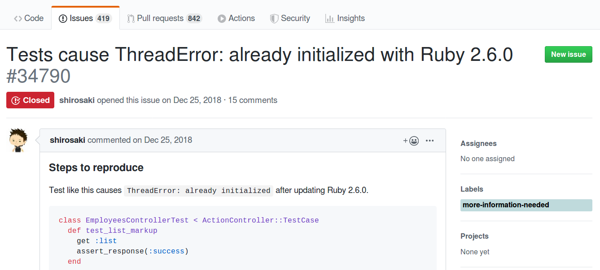
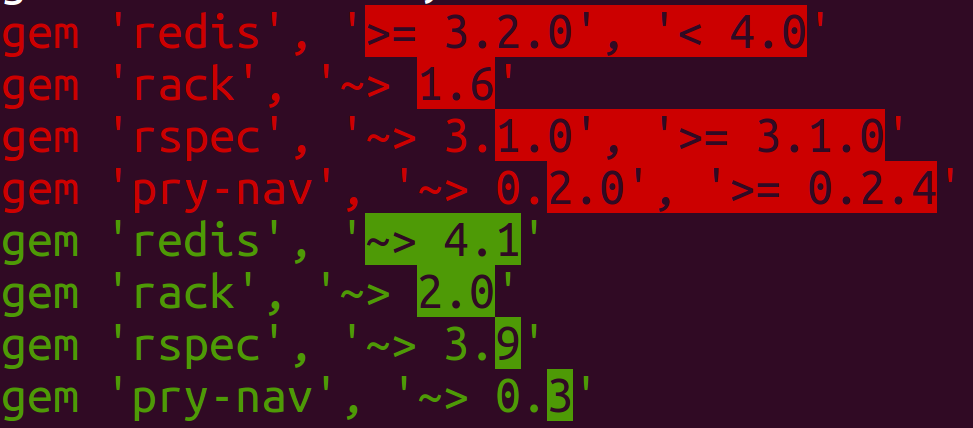
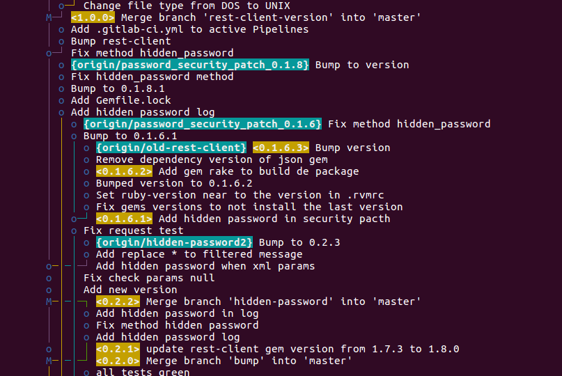

!SLIDE center subsection

# Good practices to help when upgrading the Ruby version in an application

## Fabio Perrella

### Tech Leader @ Locaweb

!SLIDE center red

# **Warning:** this talk does not have all the answers you may are looking for

## Upgrading Ruby can be very difficult sometimes! (or not)

!SLIDE center

## This talk was inspired by a very difficult process of upgrading Ruby we experienced in Locaweb

Thanks to Gabriel Klockner for the help!


!SLIDE center

# Why upgrade Ruby version?
## (in an application)

!SLIDE center

* Every christmas a new (minor) version of Ruby is released
* Every march (or february) the last minor version supported reaches the end-of-life (eol)
* Better performance (speed, GC, etc.)
* Cool new features (ex: `Kernel#then`)

!SLIDE center

# Last Ruby releases

    Ruby 2.7
    status: preview
    release date:

    Ruby 2.6
    status: normal maintenance
    release date: 2018-12-25

    Ruby 2.5
    status: normal maintenance
    release date: 2017-12-25

    Ruby 2.4
    status: security maintenance
    release date: 2016-12-25
    EOL date: 2020-03-31

!SLIDE center

# What about Rails??

- Upgrading Ruby is a prerequisite to upgrade Rails (normally)

- Rails has a release frequency slower than Ruby

- I will not talk about upgrading Rails in this talk (maybe next year!)

!SLIDE center

# The chicken and the egg

Warning: there are some issues with EOL versions of Rails and new Rubies, ex: https://github.com/rails/rails/issues/34790



!SLIDE center

## Imagine a perfect world when you upgrade the Ruby version and all the tests pass in the 1st attempt...

!SLIDE center red big

# Now, wake up!!

!SLIDE center

## Disclaimer

### If your application has few dependencies and/or has few lines of code, the upgrade can be easy, and this talk is useless for you!

!SLIDE center

## Experiments I did upgrading to 2.6.3

| Application | Current Ruby | Number of dependencies | LOC | Bundle install ok? | Dificulty to pass all tests |
| ----------- | ------------ | ---------------------- | ----| ------------------ | ------------- |
| feed-processor   | 2.2   | 139 | 16.609 | yes | easy |
| criador-de-sites | 2.3.5 | 245 | 42.222 | no  | -    |
| hosting-panel    | 2.4.2 | 156 | 36.244 | yes | easy |
| hosting-services | 2.3.5 | 155 | 55.257 | yes | **impossible** |

LOC: `git ls-files | grep .rb | xargs wc -l`

Number of dependencies: `bundle | grep Using | wc -l`

!SLIDE center

# 1st steps (easy mode)

- Change the `.ruby-version` with the new version
- Run `bundle install`
- Run the tests

!SLIDE center

# If you have no problems, congratulations!!

!SLIDE center

# To have more confidence

- Evaluate the test coverage (simplecov) and maybe increase the test coverage

- Deploy the new version together with the old version (under a load balancer) and compare the error rating of both

!SLIDE center

# Problems you may have

- Bundle install

- Running the tests

- Deploy

!SLIDE center big

# Bundle install

!SLIDE center

* Some gems only work on a specific range of Ruby versions
* Some gems have dependencies which only work on a specific range of Ruby versions
* Some gems **do not** know they only work on a specific range of Ruby versions or dependencies!

!SLIDE center

## Old gem versions normally don't know they don't work in new Ruby versions!

    @@@text
    $ ruby -v
    ruby 2.6.3p62 (2019-04-16 revision 67580) [x86_64-linux]

    $ gem install oj -v '2.13.1'
    Building native extensions. This could take a while...
    ERROR:  Error installing oj:
            ERROR: Failed to build gem native extension.

!SLIDE center

## Test the latest version within the same major

Example: https://rubygems.org/gems/oj/versions

    @@@text
    ...
    3.0.1 - April 25, 2017 (172 KB)
    3.0.0 - April 25, 2017 (172 KB)
    2.18.5 - March 22, 2017 (125 KB)   # <------- try this !
    2.18.4 - March 22, 2017 (128 KB)
    2.18.3 - March 15, 2017 (124 KB)
    2.18.2 - March 02, 2017 (125 KB)
    2.18.1 - January 13, 2017 (123 KB)
    2.18.0 - November 26, 2016 (123 KB)
    2.15.0 - March 28, 2016 (118 KB)
    ...
    2.14.3 - December 31, 2015 (117 KB)
    2.14.2 - December 19, 2015 (116 KB)
    2.14.1 - December 15, 2015 (116 KB)
    2.14.0 - December 05, 2015 (116 KB)
    2.13.1 - November 16, 2015 (115 KB)  # <--- current version
    ...

!SLIDE center

## Or try to search in CHANGELOG when it started to support some Ruby version

https://github.com/ohler55/oj/blob/develop/CHANGELOG.md

    @@@text
    2.18.0 - 2016-11-26
        Ready for Ruby 2.4.


!SLIDE center

## It would be great if all the gems specify the Ruby version they know it works, limiting the top and bottom

    @@@ruby
    s.required_ruby_version = [">= 2.3", "< 2.7"]

!SLIDE center

## When trying to upgrade a gem verion

Sometimes the error message from bundle is not so clear

    @@@text
    Bundler could not find compatible versions for
    gem "rest_model":
      In Gemfile:
        domain_api-client (~> 1.1) was resolved to 1.1.0,
        which depends on
          rest_model
        provisioning-core was resolved to 13.4.0.ruby23,
        which depends on
          rest_model (~> 0.2)
        sapi_client (~> 0.3) was resolved to 0.12.0,
        which depends on
          rest_model (>= 0.2)

What is the problem??

https://github.com/bundler/bundler/issues/6620

!SLIDE center

# Semver (Semantic Versioning)

https://semver.org

    @@@text
    Given a version number MAJOR.MINOR.PATCH, increment the:

    MAJOR version when you make incompatible API changes,
    MINOR version when you add functionality in a backwards compatible manner, and
    PATCH version when you make backwards compatible bug fixes.

**note1**: Ruby versions **do not** follow Semver, but the majority of the gems
do!

**note2**: If necessary to upgrade a major version, search for files like
CHANGELOG.md or RELEASES.md in gem's source to know why the
compatibility was broken.

**note3**: If you are a gem maintainer, https://keepachangelog.com and follow
Semver!

!SLIDE center

# How a gem specifies the required Ruby version

    @@@ruby
    # This gem will work with 1.8.6 or greater...
    spec.required_ruby_version = '>= 1.8.6'

    # Only with ruby 2.0.x
    spec.required_ruby_version = '~> 2.0'

    # Only prereleases or final releases after 2.6.0.preview2
    spec.required_ruby_version = '> 2.6.0.preview2'

https://guides.rubygems.org/specification-reference/#required_ruby_version

!SLIDE center

## Try to upgrade to the latest Ruby version

Gems are not used to restrict the new versions, examples:

    @@@text
    sinatra.gemspec:  s.required_ruby_version = '>= 2.2.0'
    webmock.gemspec:  s.required_ruby_version = '>= 2.0'
    public_suffix.gemspec:  s.required_ruby_version = ">= 2.1"
    rack.gemspec:  s.required_ruby_version = '>= 2.2.2'
    safe_yaml.gemspec:  gem.required_ruby_version = ">= 1.8.7"
    mustermann.gemspec:  s.required_ruby_version = '>= 2.2.0'
    tzinfo.gemspec:  s.required_ruby_version = '>= 1.8.7'

Upgrading from 2.3 to 2.6 **should be** easier than upgrading from 2.3 to 2.4!

!SLIDE center

## Sometimes it is ok to update directly the Gemfile.lock

(but don't tell that I told you to do it!)

- Failure installing gem `oj 2.13.1` with Ruby 2.6.3
- Gem `oj` is not defined in Gemfile (it's a 2nd lever dependency)

Example:

    @@@ruby
    heartcheck (1.0.8)
      oj

!SLIDE center

## 2 options to fix

1) Set as a dependency in Gemfile

Example:

    @@@ruby
    # Gemfile
    gem 'oj', '~> 2.18.5'

2) Change the version in Gemfile.lock

Example:

    @@@diff
    - oj (2.13.1)
    + oj (2.18.5)

3) Is there a better way??

!SLIDE center

## Restrict the versions with `'~> M.m'` ?

    @@@ruby
    # example of a gem without version specification in
    # Gemfile
    gem 'aasm'

    # $ bundle show aasm
    # .../lib/ruby/gems/2.6.0/gems/aasm-4.12.3

    # Now, add the version specification to "block" the
    # major upgrade:
    gem 'aasm', '~> 4.12'

It should prevent using a new major version which could break some things.

!SLIDE center

## If you a gem maintainer

* Do not specify dependencies with `'= M.m.p'` or `'~> M.m.p'`

* Be careful with `'>= X'` or `'> X'`

* **Prefer** `'~> M.m'` or `['>= X', '< X']`

* Believe in *Semver* and help the others to upgrade their Rubies and gems!

!SLIDE center

## Example based on a real problem

- A project in ruby 2.3 is using the gem `ws_authentication_client` wich depends on `ox ~> 2.1.3` (2nd level dependency)
- The gem `ox` supports Ruby 2.6 only in version `>= 2.7`
- In project's Gemfile it's not possible to set `gem 'ox', '~>  2.7'`

Error:

    @@@text
    Resolving dependencies....
    Bundler could not find compatible versions for gem "ox":
      In Gemfile:
        ox (~> 2.7)

        ws_authentication_client was resolved to 0.0.2, which depends on
          ox (~> 2.1.3)

!SLIDE center

# And now?

### Change the gem `ws_authentication_client` to accept new versions of gem `ox`

Example:

    @@@diff
    - spec.add_dependency 'ox', '~> 2.1.3'
    + spec.add_dependency 'ox', '~> 2.1'

!SLIDE center

## Change the build to run the tests in all supported Ruby versions

    @@@yaml
    matrix:
      include:
        - rvm: 2.3
        - rvm: 2.4
        - rvm: 2.5
        - rvm: 2.6

!SLIDE center

## If necessary, use different ruby versions and Gemfiles

    @@@yaml
    matrix:
      include:
        - rvm: "2.2.2"
        - rvm: "2.3.0"
        - rvm: "2.3.3"
        - rvm: 2.4
        - rvm: 2.4
          gemfile: Gemfile-redis-3
        - rvm: 2.4
          gemfile: Gemfile-redis-4
        - rvm: 2.5
        - rvm: 2.5
          gemfile: Gemfile-redis-3

https://github.com/locaweb/heartcheck-sidekiq/blob/master/.travis.yml

!SLIDE center

# Different Gemfiles

This gem has a dependency with the gem Redis:

    @@@ruby
    spec.add_dependency 'redis', '>= 3.2.0', '< 5'



!SLIDE center

## Then you discover the gem doesn't work with some Ruby versions

Do you need to keep this gem updated in projects with old versions of Ruby?

!SLIDE center

## This gem can be a dependency of some projects

Assuming the new verions of the gem will compatible only with `ruby >= 2.4`

| Project name    | Ruby version  | Can upgrade the gem ? |
| ----------------| ------------- | --------------------- |
| nsa             | 2.3           | **No**  |
| hosting-panel   | 2.4           | Yes |
| recipes-managed | 2.6           | Yes |

!SLIDE center

## The most updated Gems in a project

    @@@bash
    $ git log --follow -U0 -- Gemfile.lock \
        | grep -e '^[+-] ' |sed -e 's/^[ +-]*//g' \
        | sed -e 's/(.*//' \
        | grep -v revision | grep -v 'remote:' \
        | sort | uniq -c | sort -nr \
        | head -n 100

    624 provisioning-core    # <--- internal gem
    175 activesupport
    173 product_manager-representers  # <-- internal gem
     92 activerecord
     81 locaweb-authentication-client  # <-- internal gem
     72 rest_model
     64 slogger
     63 activemodel
     57 windows_web_farm_client # <-- internal gem

**Warning:** This command is not perfect!

!SLIDE center

## Strategy 1: keep compatibility with old rubies

* Allow projects with old Ruby versions upgrading the gem
* Recommended if:
    + there are **many** projects using the gem.
    + the gem is **constantly updated** in projects
* Not recommended for public (external) gems
* It will require some `if RUBY_VERSION` in the code

Example:

    @@@ruby
    # in .gemspec
    if RUBY_VERSION < '2.3.0'
      spec.add_dependency 'ox', '~> 2.1.3'
    else
      spec.add_dependency 'ox', '~> 2.1'
    end

!SLIDE center

## Build and publish the gem for each ruby version

* The `.gemspec` is processed when the gem is built (`rake build`)
* Add the ruby version to the tag to be explicit to what version it was built for

Example: `13.6.0.ruby23` and `13.6.0.ruby26`

**Warning**: Doing this, it will not work `gem 'X', '> 13.6'` in Gemfile

!SLIDE center

## Strategy 2: break compatibility with old rubies

* Cleaner code
* It is possible to forget old Rubies

!SLIDE center

But it **can be a nightmare** to manage the branches if you need to change something in older versions



!SLIDE center

# Good practices for gem projects

* Do not check `Gemfile.lock` into git (https://yehudakatz.com/2010/12/16/clarifying-the-roles-of-the-gemspec-and-gemfile)

* Set `required_ruby_version` in Gemspec with a range

* Setup the pipeline to run the tests for all supported versions

* Use different Gemfiles to run the tests (to test all supported versions of some gem)

* Only add dependencies if it is **really** necessary!

* https://keepachangelog.com and follow Semver!

!SLIDE center big

# Running the tests

!SLIDE center

## Maybe some tests will start to fail

* Check if they were ok in master branch (with the same seed)

* Debug

!SLIDE

- as vezes será necessário fazer monkey patch em gems com versões depreciadas, ex rails 4.2
- é melhor fazer monkey patch com module prepend
- dependencias externas podem atrapalhar na evolução, por exemplo versão do banco
de dados ou do redis
- problem 2: fazer os testes passarem
- arrume os warnings, ex:
```
-        expect(WebMock).to_not have_requested(:post, %r|lala/new?*|)
+        expect(WebMock).to_not have_requested(:post, %r|lala/new\?*|)
```
- problema 3: fazer o deploy funcionar


!SLIDE

# Finish him! Questions??

## Picks

The source of this presentation: https://github.com/fabioperrella/debugging-with-mastery

This presentation was made with the gem **Showoff**: https://github.com/puppetlabs/showoff

How to find a subject to do a presentation: http://www.greaterthancode.com/2016/11/21/008-sandi-metz-and-katrina-owen/

## Me

https://fabioperrella.github.io

https://github.com/fabioperrella

http://twitter.com/fabioperrella

## Work at Locaweb

https://www.locaweb.com.br/carreira
